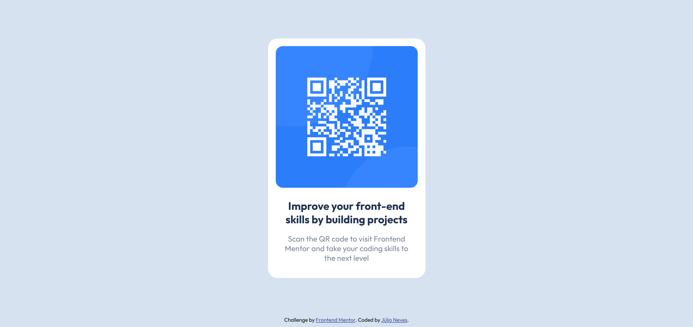

# Frontend Mentor - QR code component solution

This is a solution to the [QR code component challenge on Frontend Mentor](https://www.frontendmentor.io/challenges/qr-code-component-iux_sIO_H). Frontend Mentor challenges help you improve your coding skills by building realistic projects. 

## Table of contents

- [Overview](#overview)
  - [Screenshot](#screenshot)
  - [Links](#links)
- [My process](#my-process)
  - [Built with](#built-with)
  - [What I learned](#what-i-learned)
- [Author](#author)

**Note: Delete this note and update the table of contents based on what sections you keep.**

## Overview

### Screenshot
Mobile version:


Desktop version:



### Links

- Solution URL: [Add solution URL here](https://your-solution-url.com)
- Live Site URL: [Add live site URL here](https://your-live-site-url.com)

## My process

### Built with
- HTML, CSS;
- eleventy.js;

### What I learned
This was my first time using `min-content` to set the width. It was very helpful to make the container div the size of the image, which is fixed.
```css 
.card {
  ...
  width: min-content;
  ...
}
```

This was also my first time using `object-fit` to align images.
```css
.card__image img {
  object-fit: fill;
}
```

## Author

- Website - [Júlio Neves](https://jcnevess.github.io/)
- Frontend Mentor - [@jcnevess](https://www.frontendmentor.io/profile/jcnevess)
